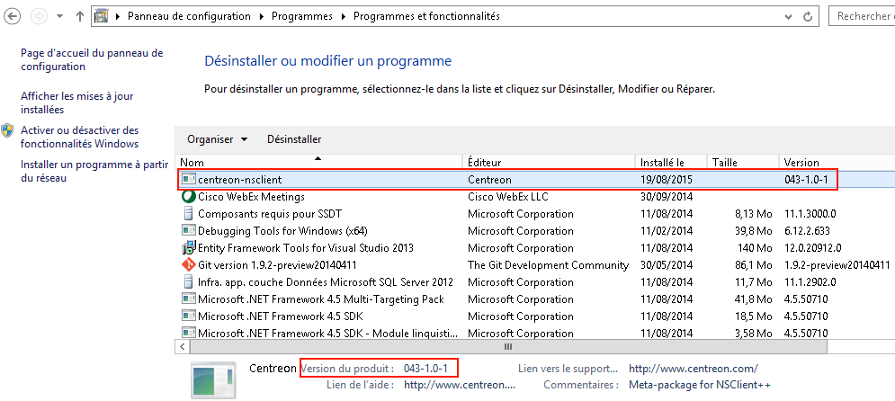

==============================
NSClient++ Windows Agent HOWTO
==============================

Overview
--------

NSClient++ is a free monitoring agent available on http://www.nsclient.org/.
This project consists in a packaging of NSClient++ to make it work easily with plugins provided by Centreon, used on Microsoft Windows plateform.

.. note::
   We are using version 0.5.0.x of NSClient++. The archive is included in our own archive for the build.

The overall principle is to compile existing Perl plugins available in Centreon Plugins project (https://github.com/centreon/centreon-plugins) and configure NSClient++ to execute them on the target Windows server.
Note that you need to install the corresponding plugins packs in Centreon so as to benefit from the commands that will communicate with NSClient++

To install NSClient++ on your Windows servers, you have 2 choices : 

  * Install an executable provided by Centreon : this is a NSClient++ installer containing an compiled Perl command including all plugins available on Windows
  * Build your own NSClient++ executable : this is a more manuel process that allows you to finely tune the plugins embedded in the archive

Both choices are described below. 

Please note that in any case, NSClient++ configuration is done through nsclient.ini that comes with sensible default.

.. warning::
    You need to pay attention to the "payload length" setting that MUST correspond to the value used by the Centreon plugin (check_centreon_nrpe), otherwise the communication won't work. By default, all NRPE request must use a payload of 8192 to avoid having "long output" problems.

Install the executable provided by Centreon
-------------------------------------------

This is the easiest way to install NSClient++ on your servers, as NSClient++ is already configured "out of the box" with all Perl plugins compiled as a Windows native binary called "centreon_plugins.exe". This plugin contains all the features available at the time of the build. At the moment, Active directory and IIS checks are embedded in this binary.

All you need to do is to select the 32bits or 64bits archive and install it on your server.

.. note::
    This is part of Centreon EMS solution or Centreon IMP subscription, please contact Centreon to get this installer.

Build your own executable
-------------------------

This is only useful if you want to compile your own "centreon_plugins.exe" so that it only contains the feature that you plan to use and not all checks provided by Centreon.
First you need to compile a native binary called "centreon_plugins.exe" with the selected plugins.
Then you need to build the NSClient++ archive including this binary.

.. note::
    This is part of Centreon EMS solution or Centreon IMP subscription, please contact Centreon to get the archive allowing you to build the archive.

Build the command 
=================

Prerequisites
*************

First, you need 2 Windows Server >= 2008: 32 bits and 64 bits.
The following packages are required:

  * Strawberry Perl 5.18.2.1 (Download on http://strawberryperl.com/)
  * Trunk of centreon-plugins repository (git clone https://github.com/centreon/centreon-plugins)

The following procedure must be done on each architecture: 32 bits and 64 bits.
If you don't have a 32 bits Windows Server, there is a procedure to compile the 32 bits executable on 64 bits Server. 

Installation
************

The prerequisites must be installed before going any further. Once
everything is installed, install CPAN Module "PAR::Packer" (replace <PERL_INSTALL_DIR>)::

  cmd> <PERL_INSTALL_DIR>\perl\bin\cpan.bat
  cpan> install PAR::Packer

It can take several minutes to install the CPAN Module.

In the parent directory containing the directory "centreon-plugins", create a "build.bat" file (replace <PERL_INSTALL_DIR>)::

  chdir /d %~dp0
  set PAR_VERBATIM=1
  <PERL_INSTALL_DIR>\perl\site\bin\pp --lib=centreon-plugins\ -o centreon_plugins.exe centreon-plugins\centreon_plugins.pl ^
  --link=<PERL_INSTALL_DIR>\c\bin\libxml2-2__.dll ^
  --link=<PERL_INSTALL_DIR>\c\bin\libiconv-2__.dll ^
  --link=<PERL_INSTALL_DIR>\c\bin\liblzma-5__.dll ^
  --link=<PERL_INSTALL_DIR>\c\bin\zlib1__.dll ^
  -M centreon::plugins::script ^
  -M apps::activedirectory::local::plugin ^
  -M apps::activedirectory::local::mode::dcdiag ^
  -M apps::activedirectory::local::mode::netdom ^
  -M apps::iis::local::plugin ^
  -M apps::iis::local::mode::listapplicationpools ^
  -M apps::iis::local::mode::applicationpoolstate ^
  -M apps::iis::local::mode::listsites ^
  -M apps::iis::local::mode::webservicestatistics ^
  -M apps::exchange::2010::local::plugin ^
  -M apps::exchange::2010::local::mode::activesyncmailbox ^
  -M apps::exchange::2010::local::mode::databases ^
  -M apps::exchange::2010::local::mode::listdatabases ^
  -M apps::exchange::2010::local::mode::imapmailbox ^
  -M apps::exchange::2010::local::mode::mapimailbox ^
  -M apps::exchange::2010::local::mode::outlookwebservices ^
  -M apps::exchange::2010::local::mode::owamailbox ^
  -M apps::exchange::2010::local::mode::queues ^
  -M apps::exchange::2010::local::mode::replicationhealth ^
  -M apps::exchange::2010::local::mode::services ^
  -M centreon::common::powershell::exchange::2010::powershell ^
  -M os::windows::local::plugin ^
  -M os::windows::local::mode::ntp ^
  --verbose
  
  pause

Add plugins and modes you need in "centreon_plugins.exe" (the example add IIS and ActiveDirectory plugin). 
Eventually, execute "build.bat" file to create executable "centreon_plugins.exe".

32 bits on 64 bits server
*************************

Install Strawberry Perl 5.18.2.1 32 bits. Once
everything is installed, install CPAN Module "PAR::Packer" (replace <PERL_INSTALL_DIR_32BITS>)::

  cmd> PATH = <PERL_INSTALL_DIR_32BITS>\c\bin;<PERL_INSTALL_DIR_32BITS>\perl\bin;C:\Windows\System32
  cmd> <PERL_INSTALL_DIR_32BITS>\perl\bin\cpan.bat
  cpan> install PAR::Packer

It can take several minutes to install the CPAN Module.

Under the directory of "centreon-plugins", create a "build.bat" file (replace <PERL_INSTALL_DIR_32BITS>)::

  chdir /d %~dp0
  set PAR_VERBATIM=1
  PATH = <PERL_INSTALL_DIR_32BITS>\c\bin;<PERL_INSTALL_DIR_32BITS>\perl\bin;C:\Windows\System32
  <PERL_INSTALL_DIR_32BITS>\perl\site\bin\pp --lib=centreon-plugins\ -o centreon_plugins.exe centreon-plugins\centreon_plugins.pl ^
  --link=<PERL_INSTALL_DIR>\c\bin\libxml2-2__.dll ^
  --link=<PERL_INSTALL_DIR>\c\bin\libiconv-2__.dll ^
  --link=<PERL_INSTALL_DIR>\c\bin\liblzma-5__.dll ^
  --link=<PERL_INSTALL_DIR>\c\bin\zlib1__.dll ^
  -M centreon::plugins::script ^
  -M apps::activedirectory::local::plugin ^
  -M apps::activedirectory::local::mode::dcdiag ^
  -M apps::activedirectory::local::mode::netdom ^
  -M apps::iis::local::plugin ^
  -M apps::iis::local::mode::listapplicationpools ^
  -M apps::iis::local::mode::applicationpoolstate ^
  -M apps::iis::local::mode::listsites ^
  -M apps::iis::local::mode::webservicestatistics ^
  -M apps::exchange::2010::local::plugin ^
  -M apps::exchange::2010::local::mode::activesyncmailbox ^
  -M apps::exchange::2010::local::mode::databases ^
  -M apps::exchange::2010::local::mode::listdatabases ^
  -M apps::exchange::2010::local::mode::imapmailbox ^
  -M apps::exchange::2010::local::mode::mapimailbox ^
  -M apps::exchange::2010::local::mode::outlookwebservices ^
  -M apps::exchange::2010::local::mode::owamailbox ^
  -M apps::exchange::2010::local::mode::queues ^
  -M apps::exchange::2010::local::mode::replicationhealth ^
  -M apps::exchange::2010::local::mode::services ^
  -M centreon::common::powershell::exchange::2010::powershell ^
  -M os::windows::local::plugin ^
  -M os::windows::local::mode::ntp ^
  --verbose
  
  pause

Add plugins and modes you need in "centreon_plugins.exe" (the example add IIS and ActiveDirectory plugin). 
Eventually, execute "build.bat" file to create executable "centreon_plugins.exe".
  
Build NRPE Agent
================

Prerequisites
*************

You need 1 Windows Server >= 2008 (32 bits or 64 bits).

Installation
************

The prerequisites must be installed before going any further. Once
everything is installed, extract the package "centreon-nsclient-builder".
The overview of directories and files:

  * bin\ : binaries to build package (no changes)
  * nsis\ : some archives (not used but no changes)
  * build\ : only useful for building process (no changes)
  * Prerequisites\ : NSClient++ msi package used (no changes)
  * resources\nsclient-043.ini : NSClient++ configuration file (can be changed by the user)
  * scripts\(win32|x64) : external script added in package (can be changed by the user)
  * builddef-(Win32|x64)-043.nsi : nsi configuration (no changes)
  * favicon_centreon.ico : icon file used for the package (can be changed)
  * logo.bmp : image used to interactive installer ;
  * generate_package.bat : script to build packages.

Configuration
*************

An user can do the following actions:

  * Edit attribute "allowed hosts" in "resources\\nsclient-043.ini" file
  * Replace "centreon_plugins.exe" in directories "scripts\\win32\\centreon" and "scripts\\x64\\centreon"
  * Replace "logo.bmp" file
  * Execute "generate_package.bat" to build new packages: "centreon-nsclient-043-1.0-1-Win32.exe" and "centreon-nsclient-043-1.0-1-x64.exe"

Do other actions in all conscience.

Package Installation
====================

You can now install NSClient++ using the package built in the previous step.
If there is an existing version a NSClient++ installed on your server, it will be uninstalled and remplaced by the new version.

When you install the package, following options are available:

  * /S : Silently installation
  * /nouninstall : no uninstall of the current package if it was already installed

Once installed, the package is displayed this way:

When NSClient++ is installed on the target Windows server, you can check the plugin is able to connect from Centreon server with::

  /usr/lib64/nagios/plugins/check_centreon_nrpe  -H <windows IP address> -p 5666 -m 8192
  I (0.4.3.143 2015-04-29) seem to be doing fine...

